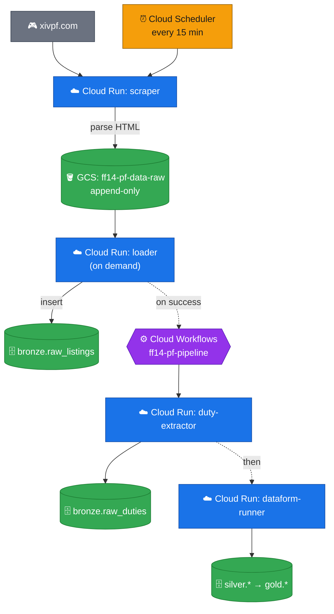

# FFXIV Party Finder Data Warehouse

An end-to-end data engineering project on Google Cloud.
It scrapes live Final Fantasy XIV Party Finder listings from [xivpf.com](https://xivpf.com), lands them in a data lake, and refines them through a medallion warehouse (bronze → silver → gold) into chart-ready analytics marts.

The whole system is serverless, event-driven, fully managed as code with Terraform, and runs at a steady-state cost of roughly $0-2 per month.

- **GCP project:** `ff14-pf-data`
- **Region:** `us-central1`
- **Cadence:** scrape every 15 minutes; transform on demand

---

## What problem it solves

Party Finder is the in-game board where FFXIV players advertise groups for raids, dungeons, and other content.
Listings are ephemeral: they appear, fill up, and expire, and the game keeps no history.
This project captures that stream over time and turns it into questions a player or analyst can actually answer:

- When should I post to fill my party the fastest?
- Which role (tank, healer, or DPS) is the current bottleneck for a given type of content?
- When is my data center busiest?
- What content is trending up or dying off week over week?
- Which data centers are net importers or exporters of players?

---

## System architecture

The pipeline is a classic ingestion → storage → transformation → serving flow, built entirely from managed GCP services.
Only the scraper is scheduled - the loader runs on demand and, on success, fires the pipeline workflow itself.

Legend: 🎮 external source · ⏰ trigger · ☁️ Cloud Run · 🪣 object storage (GCS) · 🗄️ BigQuery · ⚙️ orchestration.



See [docs/data_flow.md](docs/data_flow.md) for the medallion lineage diagram (how data is cleaned and reshaped within BigQuery).

### How it flows

1. **Ingest.** Cloud Scheduler fires the scraper every 15 minutes, it parses each listing into records and writes one timestamped JSON file to Cloud Storage.
2. **Load.** The loader flattens any pending lake files into the BigQuery bronze layer. In production it will run hourly, but currently configured to run on demand to keep costs near zero. The loader also kicks off the transform pipeline on success.
3. **Orchestrate.** Cloud Workflows runs duty-extractor first, then the Dataform runner.
4. **Transform.** Dataform executes the SQL models that clean, key, and aggregate the data into silver and gold.
5. **Serve.** The gold layer holds pre-aggregated, chart-ready marts for a BI tool or notebook to query directly.

---

## Google Cloud services used

| Service | Role in the pipeline |
|---|---|
| **Cloud Scheduler** | Cron trigger that fires the scraper every 15 minutes. |
| **Cloud Run Jobs** | Serverless containers for the four steps (scraper, loader, duty-extractor, Dataform runner); scale to zero. |
| **Cloud Storage** | Immutable raw data lake, plus a dead-letter prefix for failed runs. |
| **BigQuery** | The warehouse: `bronze`, `silver`, and `gold` datasets. |
| **Cloud Workflows** | Orders duty-extractor → Dataform after each load. |
| **Dataform** | Version-controlled SQL transforms that build silver and gold. |
| **Artifact Registry** | Stores the Docker images for the Cloud Run jobs. |
| **Secret Manager** | Holds the Git token that syncs the Dataform repo. |
| **Cloud Monitoring & Logging** | Failure alerts for scrape, load, and transform errors, routed to email. |
| **Cloud Billing Budgets** | A $5/month budget with threshold alerts. |
| **IAM & Service Accounts** | Least-privilege identities; analyst access scoped to silver and gold. |

---

## The medallion warehouse

Data is refined in three layers that separate raw capture from cleaning from business-ready aggregation.

- **Bronze - raw, append-only.** A faithful copy of each scrape plus load-tracking tables. Nothing is cleaned or joined.
- **Silver - cleaned and enriched.** Listings are typed, deduplicated, and joined to dimensions (duties, worlds, calendar). The keystone model reconstructs each listing's lifecycle: when it appeared, how long it took to fill, and whether it ever did.
- **Gold - analytics-ready marts.** Small, pre-aggregated tables built for direct charting.

### Gold marts

| Mart | Question it answers |
|---|---|
| `mart_time_to_fill` | When should I post to fill my party fastest? |
| `mart_role_demand` | Which role is the bottleneck right now? |
| `mart_activity_heatmap` | When is Party Finder busiest on my data center? |
| `mart_duty_trends` | How have popularity, fill rate, and speed for a duty on my DC moved through patch history? |
| `mart_role_trends` | Has the role bottleneck on my DC eased or worsened over patches? |
| `mart_fill_funnel` | What share of listings ever fill (the denominator behind every fill metric)? |

Full table grains, metrics, and the lifecycle model are documented in [docs/gold_marts.md](docs/gold_marts.md).

---

## Getting started

Full setup is in [docs/architecture.md](docs/architecture.md).
The short version, once authenticated:

```bash
make docker-auth          # one-time Artifact Registry login
make build-all push-all   # build + push the four service images
make deploy               # terraform apply
make help                 # list all build / run / deploy targets
```

---

## Documentation

- [docs/architecture.md](docs/architecture.md) - repo layout, data flow, full schema, design decisions
- [docs/gold_marts.md](docs/gold_marts.md) - mart catalog and the lifecycle model
- [docs/observability.md](docs/observability.md) - logging and failure-alerting runbook
- [docs/improvements.md](docs/improvements.md) - backlog and improvement opportunities

---

## Disclaimer

This project scrapes publicly visible data from [xivpf.com](https://xivpf.com).
It is not affiliated with Square Enix.
