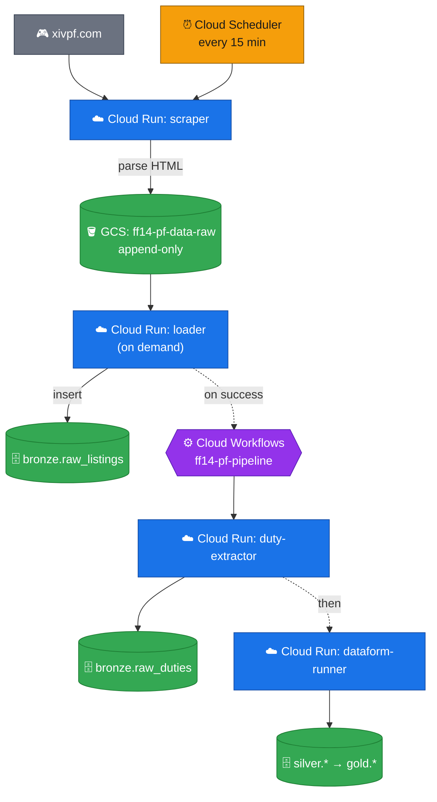
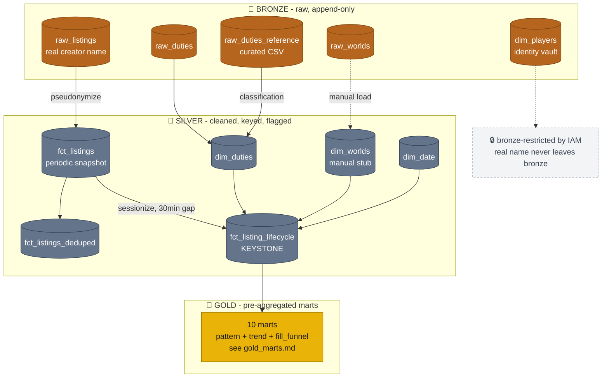

# Data Flow

Two views of the same pipeline: how the data physically moves through GCP services (orchestration), and how it is cleaned, joined, and reshaped as it crosses the medallion layers (lineage). See [`architecture.md`](architecture.md) for narrative detail and [`gold_marts.md`](gold_marts.md) for the full mart catalog.

Icons are plain emoji, not brand logos - GitHub/VS Code render Markdown's Mermaid fences without executing JS, so a real GCP or FFXIV logo (which requires registering an icon pack at runtime) won't render there. Emoji is the one icon mechanism guaranteed to display everywhere.

## Orchestration

Only the scraper is scheduled. The loader is run on demand and, on success, fires the pipeline workflow itself. The workflow uses a blocking connector, so the duty-extractor always finishes before Dataform runs.

Legend: 🎮 external source · ⏰ trigger · ☁️ Cloud Run · 🪣 object storage (GCS) · 🗄️ BigQuery · ⚙️ orchestration.

## Medallion lineage

Bronze is raw and append-only. Silver is where cleaning, keying, and the two hardest transforms happen: pseudonymization and sessionization. Gold is ten pre-aggregated marts, all sourced from one keystone fact.

Legend: 🥉 bronze · 🥈 silver · 🥇 gold · 🔒 privacy-restricted (dashed = manual/annotation, not a data transform).

**Reading the pseudonymization boundary:** `bronze.raw_listings` is the only table that ever holds a real character name. Every downstream row carries `player_hash = TO_HEX(MD5(lower(creator)|lower(creator_server)))` and `creator_initials` instead. `bronze.dim_players` is the sole reverse-lookup table, and it stays behind the same IAM line as the rest of bronze - `analyst_group` never gets bronze access.

**Reading the sessionization step:** `fct_listings` is a snapshot (one row per listing per scrape, every 15 min). `fct_listing_lifecycle` collapses that stream into sessions - a content-hashed `listing_id` can repeat weeks apart, so consecutive scrapes more than 30 minutes apart start a new session. This is the step that turns raw scrape noise into fill-rate and time-to-fill metrics, and every gold mart reads from its output, never from `fct_listings` directly.
